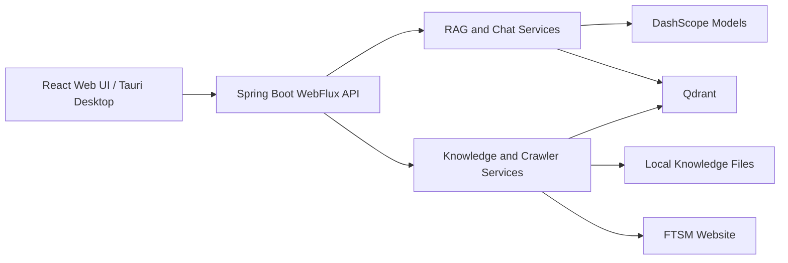

# FTSM-RAG (Java)

A full-stack **Retrieval-Augmented Generation (RAG)** system implemented in Java — the Java migration of the original [FTSM-RAG Python project](https://github.com/zhengbohou0402/FTSM-RAG). It provides hybrid document retrieval, streaming AI chat, knowledge management, website crawling, and an optional Windows desktop application.

> Sister repositories: [`GraphRAG-Java`](https://github.com/zhengbohou0402/GraphRAG-Java) (adds a knowledge-graph layer), [`RAG-Java-MultiAgent`](https://github.com/zhengbohou0402/RAG-MultiAgent) and [`RAG-Java-MultiAgent-SpringAI`](https://github.com/zhengbohou0402/RAG-Java-MultiAgent-SpringAI) (multi-agent editions).

## Highlights

- Spring Boot 3 and WebFlux reactive backend
- React 19 and Ant Design frontend
- DashScope chat, embedding, vision, and reranking models (OpenAI-compatible protocol)
- Qdrant vector storage with dense and BM25-style lexical retrieval
- Reciprocal Rank Fusion (RRF) hybrid search
- Incremental indexing with stable document and chunk identifiers
- TXT, PDF, PNG, JPG, JPEG, WebP, and GIF ingestion
- Playwright Java crawler with a Jsoup fallback
- Persistent conversations, prompts, settings, and semantic cache
- Tauri 2 Windows desktop shell with a bundled Java runtime

## Architecture



## Requirements

- JDK 17 or newer
- A DashScope API key
- Git LFS (the Windows Qdrant 1.10.0 executable is shipped via LFS)
- Node.js 20 or newer for frontend development
- Microsoft Edge or Google Chrome for browser-based crawling

You can also connect to an external Qdrant instance through environment variables.

## Quick Start

```powershell
git clone https://github.com/zhengbohou0402/FTSM-RAG-Java.git
cd FTSM-RAG-Java
git lfs pull
Copy-Item .env.example .env
```

Set `DASHSCOPE_API_KEY` in `.env`, then start the application:

```powershell
.\mvnw.cmd spring-boot:run
```

Open <http://127.0.0.1:8000>.

On Windows, the app automatically starts `qdrant_local/qdrant.exe` when port `6334` is not already in use. After the first launch, open the knowledge management page and start indexing, or call:

```powershell
Invoke-RestMethod -Method Post http://127.0.0.1:8000/api/training/start
```

## Configuration

Copy `.env.example` to `.env`. The most important settings:

| Variable | Default | Purpose |
| --- | --- | --- |
| `DASHSCOPE_API_KEY` | empty | DashScope authentication |
| `CHAT_MODEL_NAME` | `qwen-turbo` | Chat model |
| `EMBEDDING_MODEL_NAME` | `text-embedding-v3` | Embedding model |
| `QDRANT_HOST` | `localhost` | Qdrant host |
| `QDRANT_PORT` | `6334` | Qdrant gRPC port |
| `QDRANT_AUTO_START` | `true` | Start the bundled local Qdrant process |
| `CRAWLER_ENABLED` | `false` | Enable scheduled website crawling |
| `CRAWLER_INTERVAL_HOURS` | `168` | Crawl interval |
| `CRAWLER_MAX_PAGES` | `80` | Maximum pages per crawl |

Secrets and runtime state are intentionally excluded from Git.

## Development

Run backend tests and build the executable JAR:

```powershell
.\mvnw.cmd clean package
java -jar target\rag-java-0.0.1-SNAPSHOT.jar
```

Develop and rebuild the frontend (Vite writes to `src/main/resources/static`, served by Spring Boot):

```powershell
cd frontend
npm ci
npm run lint
npm run build
```

## Retrieval Pipeline

1. Knowledge files are extracted and split into overlapping chunks.
2. DashScope generates dense embeddings in batches.
3. Qdrant stores vectors and metadata.
4. Queries run dense retrieval and local BM25-style lexical retrieval.
5. Reciprocal Rank Fusion combines both result lists.
6. Source metadata and trust labels are included in the model context.

The index fingerprint includes the embedding model, collection, chunk size, chunk overlap, splitter, and supported file types. Incompatible index settings trigger a full rebuild instead of mixing vectors from different pipelines.

## Java Website Crawler

The crawler uses Playwright Java to render JavaScript pages and lazy-loaded content; it blocks images, media, and fonts to reduce traffic. If no supported browser is available, it falls back to Jsoup for static pages.

```dotenv
CRAWLER_ENABLED=false
CRAWLER_BROWSER_ENABLED=true
CRAWLER_BROWSER_AUTO_DOWNLOAD=false
CRAWLER_STATIC_FALLBACK=true
CRAWLER_STATIC_TLS_FALLBACK=true
CRAWLER_HEADLESS=true
```

TLS fallback is restricted to explicitly allowed hosts and does not change the global JVM certificate policy.

## Windows Desktop Build

The desktop package bundles the backend JAR, a minimized Java runtime, Qdrant, and seed knowledge files. Building the NSIS installer requires Rust stable, Visual Studio Build Tools (Desktop development with C++), Windows 10/11 SDK, and WebView2. See the [Tauri Windows prerequisites](https://v2.tauri.app/start/prerequisites/).

```powershell
.\scripts\build_windows_installer.ps1        # full installer -> dist\FTSM-RAG-0.2.0-windows-x64-setup.exe
.\scripts\build_windows_installer.ps1 -SkipInstaller   # prepare resources only
```

## Main API Endpoints

| Method | Endpoint | Purpose |
| --- | --- | --- |
| `GET` | `/api/health` | Application health |
| `POST` | `/api/chat` | Streaming RAG chat |
| `GET`, `POST` | `/api/settings` | Runtime settings |
| `GET`, `POST` | `/api/prompt` | System prompt management |
| `GET` | `/api/documents` | Knowledge document list |
| `POST` | `/api/upload` | Document upload |
| `DELETE` | `/api/documents/{filename}` | Document removal |
| `GET` | `/api/document-chunks` | Indexed chunk inspection |
| `POST` | `/api/training/start` | Start indexing |
| `GET` | `/api/training/status` | Indexing status |
| `POST` | `/api/knowledge/update` | Crawl and refresh knowledge |
| `GET` | `/api/knowledge/stats` | Knowledge statistics |
| `GET` | `/api/scheduler/status` | Crawler scheduler status |

## Project Structure

```text
src/main/java/                 Spring Boot backend
src/main/resources/static/     Built React frontend
src/test/java/                 Backend tests
frontend/                      React and Tauri source
data/ukm_ftsm/                 Seed knowledge documents
qdrant_local/                  Local Qdrant executable and runtime data
scripts/                       Packaging scripts
```

## Security Notes

- The server listens on `127.0.0.1` by default.
- Browser API requests are limited to approved local and Tauri origins.
- Uploaded filenames are normalized and checked against path traversal.
- API keys, conversations, local accounts, caches, logs, and vector storage are not committed.
- Knowledge content should still be reviewed before public deployment.
